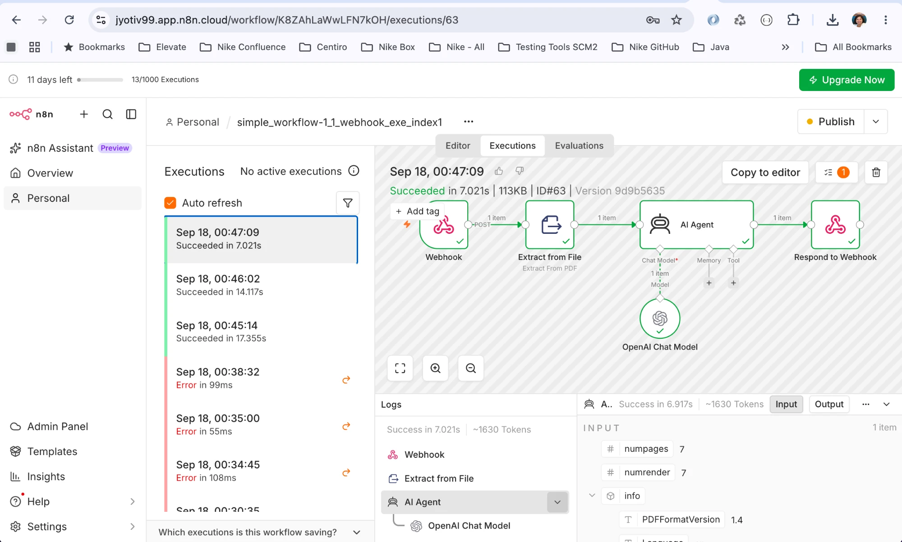
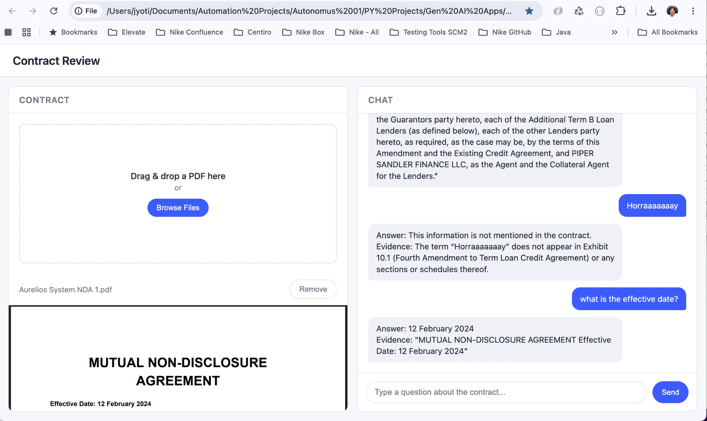

# Ask-Chirp-
Ask Chirp - The Chatter Box

## Contract Review App (n8n-powered)

A single-page contract review tool: upload a PDF, ask questions about it in
a chat panel, and get grounded answers (with cited evidence from the
document) via an n8n workflow with an AI Agent behind it.

**Status: ✅ Working end-to-end.** PDF upload → chat → n8n webhook → PDF
text extraction → AI Agent → Respond to Webhook → back to the browser, all
verified live. See [Verified working](#verified-working) below.

- **App file:** [`index1.html`](./index1.html) — plain HTML/CSS/JS, no
  build step, no dependencies. Open it directly in a browser.
- **Older 3-file version:** [`index.html`](./index.html) /
  [`styles.css`](./styles.css) / [`script.js`](./script.js) — same UI, but
  only simulates a response and is not wired to n8n. `index1.html` is the
  current, supported version.

---

### How it works

```
Browser (index1.html)
   │  upload PDF, type a question, click Send
   ▼
POST multipart/form-data  { message, data: <PDF file> }
   ▼
n8n Webhook node  (production URL, CORS "*", binary field name "data")
   ▼
Extract from File node  (Extract From PDF → text)
   ▼
AI Agent node  (Chat Model + Memory + Tool)
   ▼
Respond to Webhook node  (sends the AI Agent's answer back)
   ▼
Browser renders the reply as a chat bubble
```

The n8n workflow used here is `simple_workflow-1_1_webhook`, with this node
chain: **Webhook → Extract from File → AI Agent → Respond to Webhook**.

---

### Running the app locally

No install, no server required:

1. Clone the repo / pull `main`.
2. Open `index1.html` directly in a browser (double-click it, or drag it
   into a browser tab).
3. Drag a PDF into the drop zone (or click **Browse Files**).
4. Type a question in the chat box and click **Send** (or press Enter).

> **Note:** if you're viewing the page inside an embedded preview pane
> (e.g. VS Code's Live Preview / Simple Browser), make sure you're on a
> version of `index1.html` from `main` — an earlier bug meant the Send
> button silently did nothing in sandboxed iframes. This is fixed; Send now
> uses a plain button click handler instead of relying on native HTML form
> submission.

---

### Setting up the n8n workflow from scratch

If you need to rebuild or fork the workflow, here's the full node-by-node
setup:

#### 1. Webhook node (trigger)

1. Add a **Webhook** node as the workflow's trigger.
2. **HTTP Method:** `POST`.
3. **Path:** any unique path (this becomes part of the webhook URL).
4. Open **Options** → **+ Add option**:
   - **Allowed Origins (CORS):** `*` (so a page opened from `file://` or
     any static host can call it without a CORS rejection)
   - **Field Name for Binary Data:** `data` — this must match the
     multipart field name the app sends the PDF under
     (`formData.append("data", selectedFile, ...)` in `index1.html`)
5. **Respond:** set this to **"Using Respond to Webhook Node"** (not
   "Immediately") — the workflow needs to build a real answer before
   responding, and this makes it wait for the node in step 4.

The Webhook node gives you two URLs:
   - **Test URL** (`/webhook-test/<id>`) — only answers **one** request,
     and only after you click "Execute workflow" / "Listen for test event"
     on the canvas immediately beforehand. Good for manual testing inside
     the n8n editor, useless for a real app.
   - **Production URL** (`/webhook/<id>`) — always live, but only once the
     workflow's **Active/Publish** toggle (top-right of the editor) is on.
     This is the one `index1.html` uses.

#### 2. Extract from File node

1. Add an **Extract from File** node after the Webhook node.
2. **Operation:** `Extract From PDF`.
3. **Binary Property:** `data` (matches the Webhook node's binary field
   name from step 1).

This turns the uploaded PDF into plain text for the AI Agent to read.

#### 3. AI Agent node

1. Add an **AI Agent** node after Extract from File.
2. Attach a **Chat Model** (e.g. OpenAI Chat Model) with valid credentials.
3. Optionally attach **Memory** (for follow-up questions) and any **Tools**
   the agent should have access to.
4. In the Agent's prompt/instructions, reference the extracted PDF text
   (from the previous node) and the incoming question (from the Webhook
   node's `message` field) so it answers grounded in the actual document —
   e.g. instruct it to say "This information is not mentioned in the
   contract" when the answer isn't in the text, and to cite the exact
   clause/evidence it used. This is what makes it correctly refuse
   irrelevant questions instead of hallucinating an answer.

#### 4. Respond to Webhook node

This is the node that's easy to forget — without it, the Webhook node has
nothing to send back and every request fails with an **HTTP 500** and the
error `No Respond to Webhook node found in the workflow`.

1. Add a **Respond to Webhook** node, connected after the AI Agent node's
   output.
2. **Respond With:** `JSON` (or `Text`).
3. **Response Body:** reference the AI Agent's actual output field via the
   expression picker (`{{ }}`) — commonly `{{ $json.output }}`, but confirm
   the exact field name from the node's own output in a test execution.
4. Save the workflow, confirm it's still **Active/Published**.

#### 5. Point the app at the workflow

In `index1.html`, set the constant to your workflow's **production**
webhook URL:

```js
const N8N_WEBHOOK_URL = "https://<your-instance>.app.n8n.cloud/webhook/<your-webhook-id>";
```

---

### Request/response format

**Request** (sent by `index1.html` on every chat message):

- `Content-Type: multipart/form-data` (set automatically by the browser —
  never set this header manually when the body is a `FormData` instance,
  or the multipart boundary will be missing and the parse will fail)
- Fields:
  - `message` — the text the user typed
  - `data` — the uploaded PDF file (only present once a file has been
    selected/dropped)

**Response** (expected back from the Respond to Webhook node):

- Either a JSON body with the reply under one of `reply`, `response`,
  `message`, `output`, or `text`, or a plain text body.
  `extractReplyText()` in `index1.html` checks those fields in that order
  and falls back to showing the raw JSON if none match — update that
  function if your workflow uses a different field name.

---

### Troubleshooting

Issues actually hit while building this, in case they recur:

| Symptom | Cause | Fix |
|---|---|---|
| Clicking Send does nothing at all (no user bubble appears) | The Send button relied on the `<form>`'s native `submit` event; embedded preview panes (VS Code Live Preview, Simple Browser, etc.) render pages inside a sandboxed iframe without `allow-forms`, which silently blocks form submission before it reaches JS | Send button is `type="button"` with a direct `click` listener, plus an `Enter` keydown listener on the input — neither depends on native form submission |
| `404 "webhook is not registered"` | Using the **Test URL** (`/webhook-test/...`) without clicking "Execute workflow" in the n8n editor immediately before the request; test webhooks only answer one call | Use the **Production URL** (`/webhook/...`) and make sure the workflow is Active/Published |
| `Could not reach the workflow: Workflow returned 500` + n8n error `No Respond to Webhook node found in the workflow` | No **Respond to Webhook** node in the workflow, or the Webhook node's "Respond" option isn't set to "Using Respond to Webhook Node" | Add the node (see [step 4](#4-respond-to-webhook-node) above) and connect it after the AI Agent |
| `500` even with a Respond to Webhook node present | The workflow expected the actual PDF bytes (binary field `data`) but the app was only sending the filename as a JSON string | Send the request as `multipart/form-data` via `FormData`, with the real `File` object appended under the field name configured in the Webhook node's "Field Name for Binary Data" option |
| Browser blocks the response / silent network failure | CORS not allowed on the Webhook node | Set **Allowed Origins (CORS)** to `*` (or your specific origin) in the Webhook node's options |

---

### Verified working

Confirmed end-to-end on a real n8n workflow and a real PDF:

- **n8n execution succeeded** (`ID#63`, 7.021s) through the full chain —
  Webhook → Extract from File → AI Agent → Respond to Webhook, all green:

  

- **The app in the browser**, asking real questions about an uploaded NDA:
  it correctly refused to answer a nonsense question ("Horraaaaaaay" — not
  mentioned anywhere in the contract) instead of hallucinating, and
  correctly pulled the real effective date ("12 February 2024") with the
  exact quoted evidence from the document:

  

The whole pipeline — upload → chat → n8n webhook → PDF extraction → AI
Agent → Respond to Webhook → back to the browser — is live and answering
correctly, grounded in the actual uploaded document.
